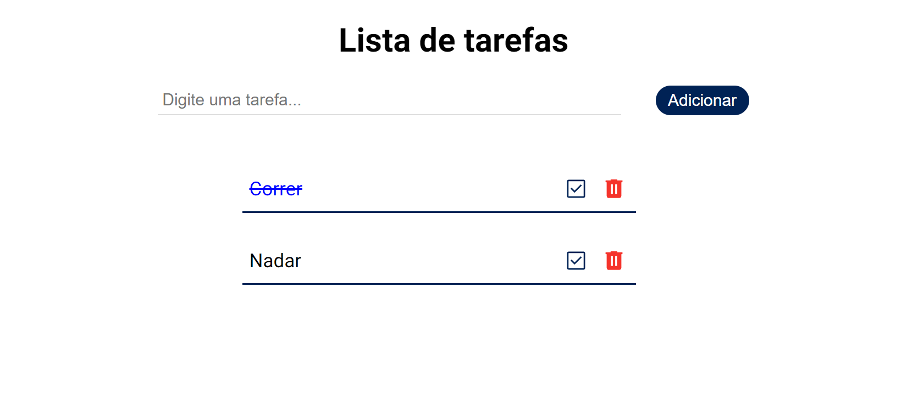
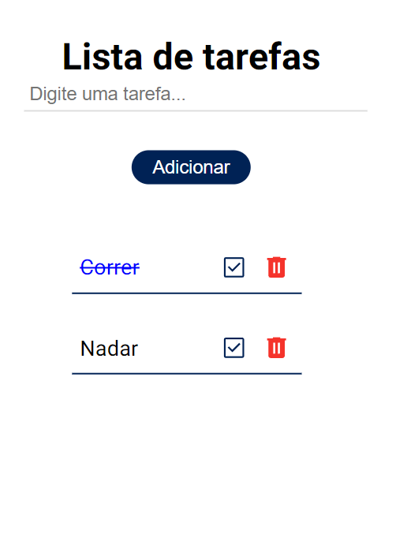

<h1 align="center"> Lista de tarefas </h1>

  

 

 <a href="#-sobre-o-projeto">Sobre</a> •
 <a href="#-funcionalidades">Funcionalidades</a> •
  <a href="#-tecnologias">Tecnologias</a> •
 <a href="#-layout">Layout</a> • 
 <a href="#-autor">Autor</a> 

## 💻 Sobre o projeto

A lista de tarefas permite ao usuário adicionar, excluir e marcar tarefas como concluídas. A lista é salva no armazenamento local para que as tarefas persistam mesmo após a atualização da página..

---

## ⚙️ Funcionalidades
- [x] Adicionar tarefas::
  - [x] APermite ao usuário inserir novas tarefas na lista através de um campo de entrada de texto.

- [x] Excluir tarefas:
  - [x] Permite ao usuário remover tarefas da lista clicando no ícone de lixeira associado a cada tarefa.

- [x] Marcar tarefas como concluídas:  
  - [x] Permite ao usuário marcar as tarefas como concluídas clicando no checkbox associado a cada tarefa. A marcação é visualmente representada por uma alteração na aparência da tarefa na lista.

- [x] Armazenamento localStorage:
    - [x] As tarefas são salvas automaticamente no armazenamento local do navegador, garantindo que as tarefas persistam mesmo após o recarregamento da página.
---

## 🚀 Tecnologias

Esse projeto foi desenvolvido com as seguintes tecnologias:

- HTML e CSS
- Javascript
- Git e Github
---
## 🎨 Layout

### Mobile

  

### Desktop

  

---
## 🦸 Autor

 
  
 <b>Amanda Lucia</b>
 
  

  

---

Feito com ❤️ por Amanda Lucia 👋🏽 [Entre em contato!](https://www.linkedin.com/in/amanda-lucia-ribeiro-pereira-434892229/)

